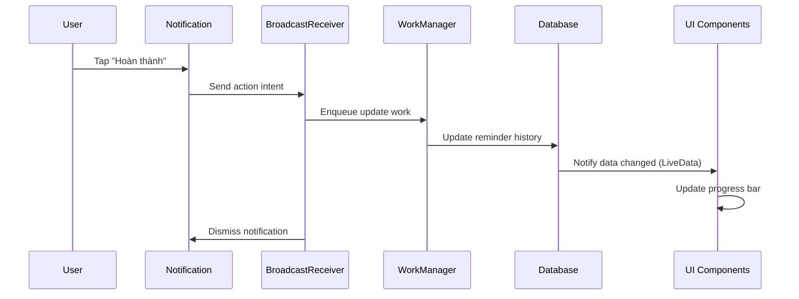

# Design Document

## Overview

Smart Reminder System là một nâng cấp toàn diện của hệ thống nhắc nhở hiện tại, tích hợp interactive notifications, progress tracking, và deadline management. Hệ thống sử dụng Android's notification actions, background processing, và real-time UI updates để tạo trải nghiệm người dùng mượt mà và hiệu quả.

## Architecture

### High-Level Architecture

```
┌─────────────────┐    ┌──────────────────┐    ┌─────────────────┐
│   UI Layer      │    │  Business Logic  │    │   Data Layer    │
│                 │    │                  │    │                 │
│ - RemindersUI   │◄──►│ - ReminderVM     │◄──►│ - ReminderRepo  │
│ - ProgressBar   │    │ - NotificationMgr│    │ - ReminderDAO   │
│ - DetailScreen  │    │ - ProgressCalc   │    │ - HistoryDAO    │
└─────────────────┘    └──────────────────┘    └─────────────────┘
         ▲                        ▲                        ▲
         │                        │                        │
┌─────────────────┐    ┌──────────────────┐    ┌─────────────────┐
│ Notification    │    │  Background      │    │   Database      │
│ System          │    │  Processing      │    │                 │
│                 │    │                  │    │ - Reminders     │
│ - Actions       │◄──►│ - WorkManager    │◄──►│ - History       │
│ - BroadcastRx   │    │ - Schedulers     │    │ - Progress      │
└─────────────────┘    └──────────────────┘    └─────────────────┘
```

### Component Interaction Flow



## Components and Interfaces

### 1. Enhanced Data Models

#### ReminderHistory Entity
```java
@Entity(tableName = "reminder_history")
public class ReminderHistory {
    @PrimaryKey
    private String id;
    private String reminderId;
    private String actionType; // "completed", "skipped"
    private long timestamp;
    private long scheduledTime;
    
    // Constructors, getters, setters
}
```

#### Enhanced Reminder Entity
```java
@Entity(tableName = "reminders")
public class Reminder {
    // Existing fields...
    private Long deadline; // New: deadline timestamp
    private int totalExpected; // New: calculated total reminders
    private int completedCount; // New: completed count
    
    // New computed property
    public float getProgressPercentage() {
        if (totalExpected == 0) return 0f;
        return (completedCount * 100f) / totalExpected;
    }
}
```

### 2. Notification System Components

#### SmartNotificationManager
```java
public class SmartNotificationManager {
    private static final String CHANNEL_ID = "smart_reminders";
    private static final String ACTION_COMPLETE = "ACTION_COMPLETE";
    private static final String ACTION_SKIP = "ACTION_SKIP";
    
    public void sendInteractiveNotification(Reminder reminder) {
        // Create notification with action buttons
        NotificationCompat.Builder builder = new NotificationCompat.Builder(context, CHANNEL_ID)
            .setContentTitle(reminder.getTitle())
            .setContentText(reminder.getDescription())
            .addAction(createCompleteAction(reminder.getId()))
            .addAction(createSkipAction(reminder.getId()))
            .setAutoCancel(false); // Don't auto-dismiss
    }
    
    private NotificationCompat.Action createCompleteAction(String reminderId) {
        Intent intent = new Intent(context, ReminderActionReceiver.class);
        intent.setAction(ACTION_COMPLETE);
        intent.putExtra("reminder_id", reminderId);
        
        PendingIntent pendingIntent = PendingIntent.getBroadcast(
            context, 0, intent, PendingIntent.FLAG_UPDATE_CURRENT | PendingIntent.FLAG_IMMUTABLE);
            
        return new NotificationCompat.Action.Builder(
            R.drawable.ic_check, "Hoàn thành", pendingIntent).build();
    }
}
```

#### ReminderActionReceiver
```java
public class ReminderActionReceiver extends BroadcastReceiver {
    @Override
    public void onReceive(Context context, Intent intent) {
        String action = intent.getAction();
        String reminderId = intent.getStringExtra("reminder_id");
        
        if (ACTION_COMPLETE.equals(action)) {
            enqueueReminderUpdate(context, reminderId, "completed");
        } else if (ACTION_SKIP.equals(action)) {
            enqueueReminderUpdate(context, reminderId, "skipped");
        }
        
        // Dismiss notification
        NotificationManagerCompat.from(context).cancel(reminderId.hashCode());
    }
    
    private void enqueueReminderUpdate(Context context, String reminderId, String actionType) {
        Data inputData = new Data.Builder()
            .putString("reminder_id", reminderId)
            .putString("action_type", actionType)
            .putLong("timestamp", System.currentTimeMillis())
            .build();
            
        OneTimeWorkRequest workRequest = new OneTimeWorkRequest.Builder(ReminderUpdateWorker.class)
            .setInputData(inputData)
            .build();
            
        WorkManager.getInstance(context).enqueue(workRequest);
    }
}
```

### 3. Background Processing

#### ReminderUpdateWorker
```java
public class ReminderUpdateWorker extends Worker {
    public ReminderUpdateWorker(@NonNull Context context, @NonNull WorkerParameters params) {
        super(context, params);
    }
    
    @NonNull
    @Override
    public Result doWork() {
        String reminderId = getInputData().getString("reminder_id");
        String actionType = getInputData().getString("action_type");
        long timestamp = getInputData().getLong("timestamp", System.currentTimeMillis());
        
        try {
            // Update database
            ReminderDatabase db = ReminderDatabase.getInstance(getApplicationContext());
            
            // Create history record
            ReminderHistory history = new ReminderHistory();
            history.setId(UUID.randomUUID().toString());
            history.setReminderId(reminderId);
            history.setActionType(actionType);
            history.setTimestamp(timestamp);
            history.setScheduledTime(timestamp); // Could be different if user responds late
            
            db.reminderHistoryDao().insert(history);
            
            // Update reminder completed count if action is "completed"
            if ("completed".equals(actionType)) {
                Reminder reminder = db.reminderDao().getReminderById(reminderId);
                if (reminder != null) {
                    reminder.setCompletedCount(reminder.getCompletedCount() + 1);
                    db.reminderDao().update(reminder);
                }
            }
            
            // Send local broadcast to update UI
            Intent updateIntent = new Intent("REMINDER_UPDATED");
            updateIntent.putExtra("reminder_id", reminderId);
            LocalBroadcastManager.getInstance(getApplicationContext()).sendBroadcast(updateIntent);
            
            return Result.success();
        } catch (Exception e) {
            Log.e("ReminderUpdateWorker", "Failed to update reminder", e);
            return Result.retry();
        }
    }
}
```

### 4. Progress Calculation System

#### ProgressCalculator
```java
public class ProgressCalculator {
    
    public static int calculateTotalExpected(Reminder reminder) {
        if (reminder.getDeadline() == null) {
            return 0; // Unlimited reminders
        }
        
        long startTime = reminder.getCreatedAt();
        long endTime = reminder.getDeadline();
        String frequency = reminder.getFrequency();
        
        switch (frequency) {
            case "daily":
                return (int) ((endTime - startTime) / (24 * 60 * 60 * 1000)) + 1;
            case "weekly":
                return (int) ((endTime - startTime) / (7 * 24 * 60 * 60 * 1000)) + 1;
            case "monthly":
                // Approximate calculation
                return (int) ((endTime - startTime) / (30 * 24 * 60 * 60 * 1000)) + 1;
            default:
                return 1; // "once"
        }
    }
    
    public static float calculateProgress(int completedCount, int totalExpected) {
        if (totalExpected == 0) return 0f;
        return Math.min(100f, (completedCount * 100f) / totalExpected);
    }
    
    public static int getProgressColor(float progress) {
        if (progress < 50f) return R.color.progress_red;
        if (progress < 80f) return R.color.progress_yellow;
        return R.color.progress_green;
    }
}
```

### 5. UI Components

#### Enhanced RemindersAdapter
```java
public class RemindersAdapter extends RecyclerView.Adapter<RemindersAdapter.ViewHolder> {
    
    public static class ViewHolder extends RecyclerView.ViewHolder {
        TextView titleText;
        TextView descriptionText;
        TextView progressText;
        ProgressBar progressBar;
        ImageView statusIcon;
        TextView deadlineText;
        
        public void bind(Reminder reminder) {
            titleText.setText(reminder.getTitle());
            descriptionText.setText(reminder.getDescription());
            
            // Progress display
            float progress = reminder.getProgressPercentage();
            progressBar.setProgress((int) progress);
            progressBar.setProgressTintList(ColorStateList.valueOf(
                ContextCompat.getColor(itemView.getContext(), 
                ProgressCalculator.getProgressColor(progress))));
            
            if (reminder.getTotalExpected() > 0) {
                progressText.setText(String.format("%d/%d hoàn thành (%.0f%%)", 
                    reminder.getCompletedCount(), 
                    reminder.getTotalExpected(), 
                    progress));
            } else {
                progressText.setText("Không giới hạn thời gian");
            }
            
            // Status icon
            if (progress >= 100f) {
                statusIcon.setImageResource(R.drawable.ic_celebration);
                statusIcon.setVisibility(View.VISIBLE);
            } else if (reminder.getDeadline() != null && 
                       System.currentTimeMillis() > reminder.getDeadline()) {
                statusIcon.setImageResource(R.drawable.ic_warning);
                statusIcon.setVisibility(View.VISIBLE);
            } else {
                statusIcon.setVisibility(View.GONE);
            }
            
            // Deadline display
            if (reminder.getDeadline() != null) {
                SimpleDateFormat sdf = new SimpleDateFormat("dd/MM/yyyy", Locale.getDefault());
                deadlineText.setText("Hết hạn: " + sdf.format(new Date(reminder.getDeadline())));
                deadlineText.setVisibility(View.VISIBLE);
            } else {
                deadlineText.setVisibility(View.GONE);
            }
        }
    }
}
```

## Data Models

### Database Schema Updates

#### Reminders Table (Enhanced)
```sql
CREATE TABLE reminders (
    id TEXT PRIMARY KEY,
    title TEXT NOT NULL,
    description TEXT,
    reminderTime INTEGER NOT NULL,
    frequency TEXT NOT NULL,
    isActive INTEGER NOT NULL,
    medicineId TEXT,
    createdAt INTEGER NOT NULL,
    updatedAt INTEGER NOT NULL,
    -- New fields
    deadline INTEGER,
    totalExpected INTEGER DEFAULT 0,
    completedCount INTEGER DEFAULT 0
);
```

#### ReminderHistory Table (New)
```sql
CREATE TABLE reminder_history (
    id TEXT PRIMARY KEY,
    reminderId TEXT NOT NULL,
    actionType TEXT NOT NULL, -- 'completed' or 'skipped'
    timestamp INTEGER NOT NULL,
    scheduledTime INTEGER NOT NULL,
    FOREIGN KEY (reminderId) REFERENCES reminders(id) ON DELETE CASCADE
);
```

### Repository Pattern

#### ReminderRepository (Enhanced)
```java
public class ReminderRepository {
    private ReminderDao reminderDao;
    private ReminderHistoryDao historyDao;
    
    public LiveData<List<Reminder>> getAllRemindersWithProgress() {
        return reminderDao.getAllRemindersWithProgress();
    }
    
    public LiveData<List<ReminderHistory>> getReminderHistory(String reminderId) {
        return historyDao.getHistoryByReminderId(reminderId);
    }
    
    public void updateReminderProgress(String reminderId) {
        // Recalculate completed count from history
        int completedCount = historyDao.getCompletedCountByReminderId(reminderId);
        reminderDao.updateCompletedCount(reminderId, completedCount);
    }
}
```

## Error Handling

### Notification Action Failures
- **Network Issues:** Store actions locally and retry when connection restored
- **Database Errors:** Implement exponential backoff retry mechanism
- **Invalid Reminder ID:** Log error and show user-friendly message

### Progress Calculation Errors
- **Division by Zero:** Handle unlimited reminders gracefully
- **Date Calculation Issues:** Validate date ranges and provide fallbacks
- **Concurrent Updates:** Use database transactions for consistency

### UI Error States
- **Loading States:** Show progress indicators during background operations
- **Empty States:** Display helpful messages when no reminders exist
- **Error States:** Show retry options for failed operations

## Testing Strategy

### Unit Tests
- **ProgressCalculator:** Test all frequency types and edge cases
- **ReminderUpdateWorker:** Mock database operations and test success/failure paths
- **NotificationManager:** Test notification creation and action setup

### Integration Tests
- **Database Operations:** Test reminder and history CRUD operations
- **WorkManager Integration:** Test background task execution
- **Notification Actions:** Test end-to-end action handling

### UI Tests
- **Progress Bar Display:** Test different progress states and colors
- **Reminder List:** Test item display with various reminder states
- **User Interactions:** Test tap actions and navigation

### Performance Tests
- **Large Dataset:** Test with 1000+ reminders and history records
- **Background Processing:** Measure WorkManager task execution time
- **Memory Usage:** Monitor memory consumption during heavy operations

## Security Considerations

### Notification Security
- Use FLAG_IMMUTABLE for PendingIntents (Android 12+)
- Validate reminder IDs in BroadcastReceiver
- Prevent unauthorized notification actions

### Data Privacy
- Encrypt sensitive reminder content
- Implement proper user authentication
- Follow GDPR guidelines for data retention

### Background Processing
- Limit WorkManager task execution time
- Implement proper error logging without exposing sensitive data
- Use secure communication between components